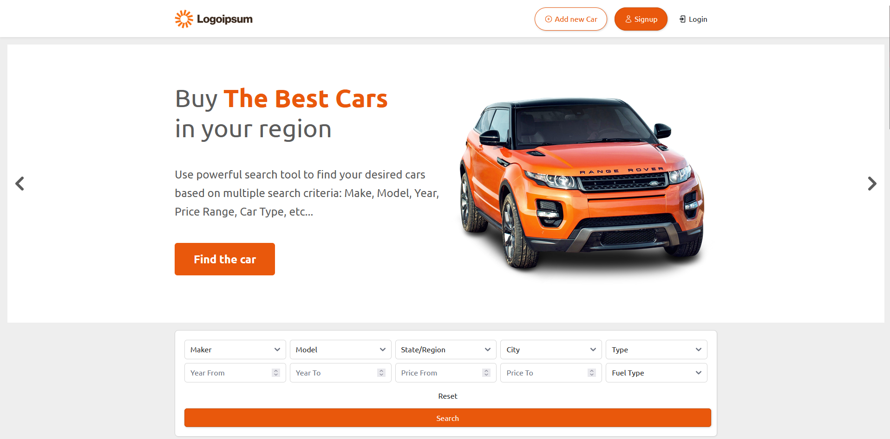

# Car Sales Platform - Laravel 12



A comprehensive car sales platform built using the Laravel 12 framework. This project serves as a capstone for a Laravel 12 course and is primarily developed for learning purposes. It demonstrates key Laravel concepts while providing a foundation for a functional car sales application, including user authentication, car listings, and more.

## Purpose and Learning Goals

This repository is a hands-on learning project to explore the Laravel ecosystem. Key learning objectives include:
- Understanding MVC architecture in Laravel.
- Implementing routing, controllers, and Eloquent models.
- Working with Blade templating for dynamic views.
- Handling form validation and database migrations.
- Integrating frontend asset bundling with Vite.
- Setting up automated testing with PHPUnit.
- Deploying a Laravel application to a VPS server.

The project is designed to be extensible, allowing for experimentation and addition of advanced features.

## Tech Stack

- **Framework**: Laravel 12.x
- **Language**: PHP 8.2+
- **Templating**: Blade
- **Frontend Tooling**: Vite (with NPM for asset management)
- **Database**: MySQL (recommended) or SQLite (for local development)
- **Testing**: PHPUnit / Pest-compatible
- **Other Tools**: Composer for PHP dependencies, Node.js for JS dependencies

## Key Features and Functionalities

This demo application showcases a basic car sales platform with the following functionalities:
- **User Authentication**: Registration, login, and logout using Laravel's built-in authentication system.
- **Car Listings**: Create, read, update, and delete (CRUD) operations for car listings, including details like brand, model, price, and description.
- **Brands and Models Management**: Eloquent models for managing car brands and models with relationships.
- **Image Uploads**: Support for uploading and displaying car images (stored in Laravel's storage system).
- **Search and Filters**: Basic filtering options for car listings (e.g., by price, brand, or year).
- **RESTful API Routes**: Defined in `routes/web.php` for clean, maintainable endpoints.
- **Form Validation**: Secure input handling using Laravel's validation rules and form requests.
- **Database Seeding**: Optional seeders for populating the database with sample data.
- **Responsive UI**: Server-rendered Blade views with Vite-bundled CSS and JS for a modern look.

## GitHub Actions

This repository is configured with GitHub Actions for automated workflows, including:
- **CI/CD Pipeline**: Runs tests, lints code, and deploys to the VPS on push to the main branch.
- **Testing Workflow**: Automatically executes PHPUnit tests on pull requests and commits.
- **Dependency Checks**: Ensures compatibility and security of Composer and NPM dependencies.

Workflow configurations can be found in the `.github/workflows/` directory.

## Quick Start

### Prerequisites
- PHP 8.2+ (with extensions: OpenSSL, PDO, Mbstring, Tokenizer, XML, Ctype, Fileinfo, Curl, DOM)
- Composer (latest version)
- Node.js & NPM (LTS recommended)
- MySQL 8+ or SQLite

### Installation
1. Clone the repository:
   ```
   git clone https://github.com/Szafter12/Car-sales-platform-laravel.git
   cd Car-sales-platform-laravel
   ```

2. Install PHP dependencies:
   ```
   composer install
   ```

3. Install JS dependencies:
   ```
   npm install
   ```

4. Set up the environment:
   ```
   cp .env.example .env
   php artisan key:generate
   ```
   Update `.env` with your database details (e.g., MySQL or SQLite).

5. Create and migrate the database:
   ```
   php artisan migrate
   php artisan db:seed  # Optional: Seed with sample data
   ```

6. Build frontend assets:
   ```
   npm run dev  # For development with hot reloading
   # or
   npm run build  # For production
   ```

7. Serve the application:
   ```
   php artisan serve
   ```
   Visit [http://127.0.0.1:8000](http://127.0.0.1:8000) in your browser.

For storage links (e.g., image uploads):
```
php artisan storage:link
```

## Testing

Run the test suite:
```
php artisan test
# or
./vendor/bin/phpunit
```

Tests cover core functionalities like routes, controllers, and models.
